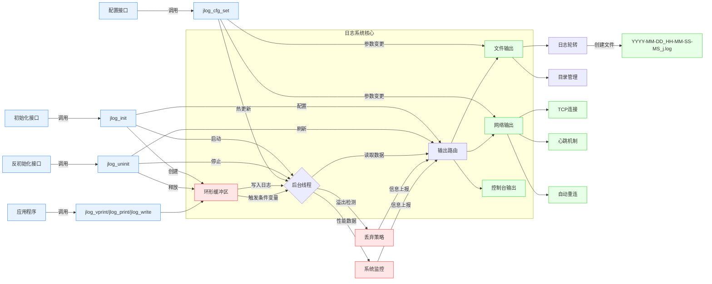
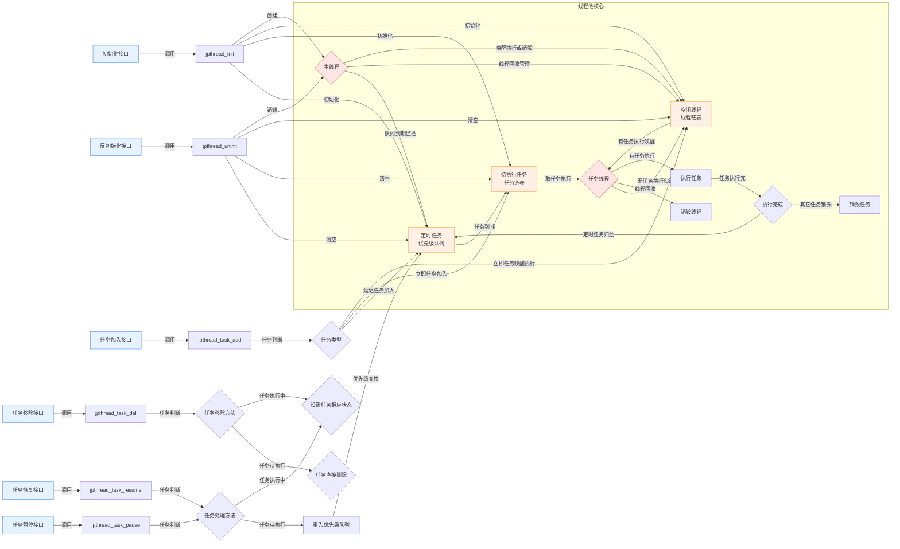

# JCore 核心开发库说明

## 前言

JCore 是一个专注于 C 语言开发的核心库，旨在为开发者提供高效、实用的数据结构、工具和算法。通过精心设计和优化，JCore 帮助开发者在复杂的系统环境中实现高性能的代码，同时保持代码的简洁和可维护性。

JCore 的设计理念是“简单、高效、可靠”，他致力于为开发者提供以下核心价值：

1. **高效的数据结构**：JCore 提供了多种高效的数据结构，如动态数组、动态字符串、链表、哈希表、位图、红黑树和优先级队列，帮助开发者在不同场景下快速实现复杂的数据管理需求。
2. **模板代码生成器**：对动态数组、内存池、双向链表、哈希表、红黑树提供模板脚本生成代码。
    * 生成的双向链表、哈希表、红黑树使用内存池分配节点和数据，节点记录序号而不是指针，大大减小了内存占用，比如常规红黑树节点占用24个字节，而使用序号的只占用8或4个字节。
3. **实用的工具模块**：JCore 包含了内存调试工具、日志工具、线程池等实用模块，帮助开发者快速定位和解决问题，提升开发效率。
4. **跨平台支持**：JCore 封装了不同操作系统的核心接口，支持跨平台开发，确保代码在不同系统环境下的兼容性和一致性(目前只封装了Posix接口)。
5. **高性能与低开销**：JCore 的每个模块都经过精心优化，确保在提供丰富功能的同时，保持低内存占用和高执行效率。
6. **易于集成与扩展**：JCore 的模块化设计使得开发者可以轻松地将所需功能集成到现有项目中，同时提供了灵活的扩展接口，满足不同项目的定制化需求。

## 功能列表

JCore 提供了丰富的功能模块，涵盖了数据结构、实用工具、接口封装等多个方面。以下是对各个模块的简要说明，详细的接口说明请参考对应的头文件。

### 实用工具

### 实用工具

JCore 提供了多种实用工具模块，帮助开发者快速定位和解决问题，提升开发效率。以下是对各个工具的简要说明，详细的设计和实现原理将在后续章节中展开。

* [jhook内存调试工具](#jhook内存调试工具)：用于调试内存问题，支持内存越界和内存泄漏的检测
    * 文件：`jhook/jhook.c`, `jhook/jlisthook.c`, `jhook/jtree.c`, `jhook/jtree.h`, `jhook/jtreehook.c`
    * 特点：
        * 采用代码注入的方式，无需重新编译原始程序即可调试内存问题
        * 支持动态链接和库函数替换两种方式
        * 提供两种实现：基于单向循环链表的 `libjlisthook.so` 和基于红黑树的 `libjtreehook.so`

* [jlog日志工具](#jlog日志工具)：高效的日志库，支持多线程、多输出方式
    * 文件：`common/jlog_core.h`, `common/jlog.h`, `common/jlog.c`
    * 特点：
        * 支持输出到终端、文件和网络
        * 使用独立线程进行日志写入，避免阻塞主线程
        * 提供日志轮转、日志等级控制、性能监控等功能

* [jpthread线程池工具](#jpthread线程池工具)：高效的线程池和定时器实现
    * 文件：`common/jpthread.h`, `common/jpthread.c`
    * 特点：
        * 支持立即执行、延迟执行和周期执行的任务
        * 动态线程管理，空闲线程自动回收
        * 资源复用，减少系统调用开销

### 数据结构

C++ STL的容器内部实现原理与JCore中的数据结构的核心原理基本一致。通过JCore提供的这些数据结构，开发者可以轻松实现与C++ STL相似的功能，同时保持代码的高效和简洁。

* **数组模块**：提供动态数组的两种实现
    * 文件：`common/jvector.h`, `common/jvector.c` / `template/jvector.sh`
    * C++ STL对应：`std::vector`、`std::array`
    * 特点：
        * jvector.h实现：不记录类型，只记录类型大小，操作void指针
        * jvector.sh实现：记录类型，由用户通过运行脚本生成自己的动态数组实现

* **字符串模块**：提供动态字符串
    * 文件：`common/jstring.h`, `common/jstring.c`
    * C++ STL对应：`std::string`
    * 特点：
        * 类似动态数组jvector.sh的设计，但保证字符串尾后字节为空

* **链表模块**：提供双向链表和单向循环链表，提供双向链表的两种实现
    * 文件：`common/jlist.h` / `template/jlist.sh`
    * C++ STL对应：`std::list`、`std::forward_list`、`std::stack`、`std::queue`、`std::deque`、`std::stack`
    * 特点：
        * jlist.h实现：双向链表类似Linux内核的双向链表设计，节点需要两个指针；单向循环链表更节省内存，仅需一个指针
        * jlist.sh实现：记录类型，由用户通过运行脚本生成自己的双向链表实现，使用内存池，节点记录的是整数序号而不是指针
            * Makefile中使用jlist.sh自动生成了jplist.c和jplist.h，实现了节点数据是void *的双向链表

* **位图模块**：提供位图
    * 文件：`common/jbitmap.h`
    * C++ STL对应：`std::bitset`
    * 特点：
        * 类似linux位图的接口，但未实现原子操作

* **哈希表模块**：提供哈希表的两种实现
    * 文件：`common/jhashmap.h`, `common/jhashmap.c` / `template/jhashmap.sh`
    * C++ STL对应：`std::unordered_map`、`std::unordered_set`
    * 特点：
        * jhashmap.h实现：使用方式统一为类似链表的操作，降低使用难度；支持高效的插入、删除、查找和遍历操作
        * jhashmap.sh实现：记录类型，由用户通过运行脚本生成自己的哈希表实现，使用内存池，节点记录的是整数序号而不是指针
            * Makefile中使用jhashmap.sh自动生成了jphashmap.c和jphashmap.h，实现了节点数据是void *哈希表

* **红黑树模块**：提供红黑树的两种实现
    * 文件：`common/jrbtree.h`, `common/jrbtree.c` / `template/jrbtree.sh`
    * C++ STL对应：`std::map`、`std::set`、`std::multimap`、`std::multiset`
    * 特点：
        * jrbtree.h实现：使用方式统一为类似链表的操作，降低使用难度，支持高效的插入、删除和查找操作
        * jrbtree.sh实现：记录类型，由用户通过运行脚本生成自己的红黑树实现，使用内存池，节点记录的是整数序号而不是指针
            * 整个节点是uint64_t或uint32_t大小，在64位系统上节点只占8/4个字节，而传统的节点需要占用24个字节(3个指针)
            * Makefile中使用jrbtree.sh自动生成了jprbtree.c和jprbtree.h，实现了节点数据是void *的红黑树

* **优先级队列模块**：提供基于最小堆的优先级队列
    * 文件：`common/jpqueue.h`
    * C++ STL对应：`std::priority_queue`
    * 特点：
        * 支持删除任意位置的元素，复杂度和队首删除的复杂度相同
        * 高效的插入和删除操作

### 接口封装

JCore 封装了不同操作系统的核心接口，屏蔽了系统调用的差异，支持跨平台开发。目前仅封装了部分 POSIX 接口。

* **优化模块**：提供编译器的常用属性和内建函数的实现(例如位计数操作)
    * 文件：`common/joptimize.h`

* **线程模块**：封装不同系统的线程和线程保护接口
    * 文件：`$OSDIR/jthread.h`

* **时间模块**：封装不同系统的时间和日期接口
    * 文件：`$OSDIR/jtime.h`

* **定时器模块**：封装不同系统的定时器接口
    * 文件：`$OSDIR/jtimer.h`

* **文件模块**：封装不同系统的文件和目录接口
    * 文件：`$OSDIR/jfs.h`, `$OSDIR/jfs.c`, `common/jfs_c.c`

* **网络模块**：封装不同系统的 TCP 和 UDP 接口，提供易于使用的网络库
    * 文件：`$OSDIR/jsocket.h`, `$OSDIR/jsocket.c`

* **资源模块**：获取系统资源占用情况，包括进程的 CPU 和内存占用、系统的 CPU 和内存占用、网络收发情况等
    * 文件：`$OSDIR/jperf.h`, `$OSDIR/jperf.c`

注：`$OSDIR` 表示不同系统的封装接口目录，例如：`posix`、`windows`（目前仅支持 Linux）。

### 基础功能

* **文件缓冲模块**：提供文件读写缓冲功能，避免大量小块文件读写引起的性能下降
    * 文件：`common/jfcache.h`, `common/jfcache.c`

* **INI 配置模块**：提供 INI 配置文件的解析和存储功能，支持转义字符的解析
    * 文件：`common/jini.h`, `common/jini.c`

* **内存块模块**：提供内存块功能，加快小内存分配速度，减少内存碎片
    * 文件：`common/jbheap.h`, `common/jbheap.c`

* **内存池模块**：提供内存池功能，支持固定大小内存的申请和归还，减少内存碎片，两种实现
    * 文件：`common/jpheap.h`, `common/jpheap.c`, `template/jpheap.sh`
    * 特点：
        * jpheap.h实现：不记录类型，只记录类型大小，操作void指针，不支持序号和扩容接口
        * jpheap.sh实现：记录类型，由用户通过运行脚本生成自己的内存池实现，提供序号接口和扩容接口

* **内存调试模块**：提供内存调试功能，支持内存泄漏、内存越界和内存重复释放的检测
    * 文件：`common/jheap.h`, `common/jheap.c`

### 测试模块

JCore 提供了各个模块的简单测试程序，方便开发者验证功能。

* **测试动态数组模块**：`test/jvector_test.c`
* **测试动态字符串模块**：`test/jstring_test.c`
* **测试哈希表和内存池模块**：`test/jhashmap_test.c`
* **测试位图模块**：`test/jbitmap_test.c`
* **测试红黑树模块**：`test/jrbtree_test.c`
* **测试优先级队列模块**：`test/jpqueue_test.c`
* **测试内存调试模块**：`test/jheap_debug_test.c`
* **测试INI配置模块**：`test/jini_test.c`
* **测试线程池模块**：`test/jpthread_test.c`
* **测试日志模块**：`test/jlog_client_test.c`, `test/jlog_server_test.c`
* **测试网络模块**：`test/jsock_client_test.c`, `test/jsock_udp_test.c`
* **测试代码模板生成**：`template/test/jp*_test.c` ，测试方法如下
    1. 按测试文件的头部说明的命令在template目录下运行，生成代码
    2. 在template/test下运行编译命令：`gcc -o j*_test j*_test.c ../j*.c -I.. -I../../common/ -W -Wall -O2`

## jhook内存调试工具

* 内存调试工具jhook仅用约800行核心代码就实现了valgrind约26000行代码实现的memcheck的核心功能，无需重新编译程序即可完成内存越界分析和内存泄漏分析。
    * 代码注入的实现原理是使用 `LD_PRELOAD` 在程序运行前优先加载的指定的动态库，这个库中重新定义堆分配释放函数，加入调试和统计钩子。
    * 内存越界分析的核心思想是分配内存时多分配一些内存，在尾部内存处memset成校验字节，如果检测到尾部校验字节不对，就判定为内存有越界。
    * 内存泄漏分析的核心思想是以“分配大小和函数调用栈”为锚点，分配的内存指针挂载在锚点上，从而统计指定锚点分配了多少次，释放了多少次，如果“分配减释放”的值一直在增大，则判定该位置存在内存泄漏。
* 内存调试工具jhook根据记录统计数据的数据结构，有两个实现，两者的功能和接口是完全一致的，选择其中一个实现即可。
    * `libjlisthook.so`: 由 `jlisthook.c` `jhook.c` `jlist.h` 编译生成，使用单向循环列表记录统计数据，节点占用内存空间较小，但有大量分配数据时记录统计信息较慢。
    * `libjtreehook.so`: 由 `jtreehook.c` `jhook.c` `jtree.h`  `jtree.c` 编译生成，使用红黑树记录统计数据，节点占用内存空间较大，但有大量分配数据时记录统计信息较快，统计信息打印时按分配单元大小从小到大排序。

注：用户也可以使用开源工具 `valgrind --tool=memcheck --leak-check=full --show-leak-kinds=all <bin>` 命令查找内存泄漏。

* 使用jhook检测的内存泄漏

```c
$ make O=obj check_cycle=10 check_unwind=y check_depth=10 # 编译选项
$ LD_PRELOAD=/home/lengjing/data/jcore/obj/libjtreehook.so ./yyjson twitter.json 1
[mut] read=3     parse=3     format=3     unformat=2
--------------------------------------------------------
size     alloc    free     diff     addr
1024     1        0        1        0x7f936fd1dd04:(_IO_file_doallocate+0x94) | 0x7f936fd2ded0:(_IO_doallocbuf+0x50) | 0x7f936fd2cf30:(_IO_file_overflow+0x1b0) | 0x7f936fd2b6b5:(_IO_file_xsputn+0xe5) | 0x7f936fd12972:(psiginfo+0x13512) | 0x7f936fdca27b:(__printf_chk+0xab) | 0x55895411646f:(main+0x20f) | 0x7f936fcc0083:(__libc_start_main+0xf3) | 0x55895411663e:(_start+0x2e)
631518   1        0        1        0x55895411d290:(yyjson_read_opts+0xb0) | 0x558954116358:(main+0xf8) | 0x7f936fcc0083:(__libc_start_main+0xf3) | 0x55895411663e:(_start+0x2e)
631632   1        0        1        0x55895411d64e:(yyjson_read_opts+0x46e) | 0x558954116358:(main+0xf8) | 0x7f936fcc0083:(__libc_start_main+0xf3) | 0x55895411663e:(_start+0x2e)
----------- total=1264174    peak=3894705    -----------
```

* 使用valgrind检测的内存泄漏

```
$ valgrind --tool=memcheck --leak-check=full --show-leak-kinds=all ./yyjson twitter.json 1
==240599== Memcheck, a memory error detector
==240599== Copyright (C) 2002-2017, and GNU GPL'd, by Julian Seward et al.
==240599== Using Valgrind-3.15.0 and LibVEX; rerun with -h for copyright info
==240599== Command: ./yyjson twitter.json 1
==240599==
[mut] read=14    parse=27    format=19    unformat=14
==240599==
==240599== HEAP SUMMARY:
==240599==     in use at exit: 1,263,150 bytes in 2 blocks
==240599==   total heap usage: 57 allocs, 55 frees, 7,069,897 bytes allocated
==240599==
==240599== 631,518 bytes in 1 blocks are indirectly lost in loss record 1 of 2
==240599==    at 0x483B7F3: malloc (in /usr/lib/x86_64-linux-gnu/valgrind/vgpreload_memcheck-amd64-linux.so)
==240599==    by 0x11028F: yyjson_read_opts (in /home/lengjing/data/test/yyjson)
==240599==    by 0x109357: main (in /home/lengjing/data/test/yyjson)
==240599==
==240599== 1,263,150 (631,632 direct, 631,518 indirect) bytes in 1 blocks are definitely lost in loss record 2 of 2
==240599==    at 0x483B7F3: malloc (in /usr/lib/x86_64-linux-gnu/valgrind/vgpreload_memcheck-amd64-linux.so)
==240599==    by 0x11064D: yyjson_read_opts (in /home/lengjing/data/test/yyjson)
==240599==    by 0x109357: main (in /home/lengjing/data/test/yyjson)
==240599==
==240599== LEAK SUMMARY:
==240599==    definitely lost: 631,632 bytes in 1 blocks
==240599==    indirectly lost: 631,518 bytes in 1 blocks
==240599==      possibly lost: 0 bytes in 0 blocks
==240599==    still reachable: 0 bytes in 0 blocks
==240599==         suppressed: 0 bytes in 0 blocks
==240599==
==240599== For lists of detected and suppressed errors, rerun with: -s
==240599== ERROR SUMMARY: 1 errors from 1 contexts (suppressed: 0 from 0)
```

### jhook编译方式

```sh
make O=obj check_cycle=10 check_tofile=n check_unwind=n check_depth=1
```

* [IMake](https://github.com/lengjingzju/cbuild-ng) 变量
    * O=xxx: 指定编译输出目录
    * DESTDIR=xxx: 指定安装目录
    * DEPDIR=xxx: 指定依赖包的根目录
* 私有变量
    * check_cycle=N: check_cycle为几秒检测一次，默认为10s
        * make传入此变量会创建一个线程每N秒检测一次内存情况，否则线程空转不检测
    * check_tofile=<y|n>: 输出到文件还是终端，默认是n，输出到文件
        * 设置为 `y` 时输出到文件 `heap_memory_info.<pid>.log` 而不是终端
    * check_unwind=<y|n>: 是否使用libunwind记录栈信息，默认是n，没有依赖其它包，不会记录函数名和偏移量
        * 设置为 `y` 时需要依赖 [libunwind](https://github.com/libunwind/libunwind)
    * check_depth=N: 记录的调用栈深度，默认值为1
        * 如果check_unwind未设置为y，check_depth为1时使用__builtin_return_address记录，大于1时使用backtrace记录

### jhook接口说明

* `jhook_init`

```c
/**
 * @brief   初始化内存调试管理结构
 * @param   tail_num [IN] 尾部校验字节的个数，最大256，用于检测是否越界，可设置为0表示不检测越界
 * @return  成功返回0; 失败返回-1
 * @note    无
 */
int jhook_init(int tail_num);
```

* `jhook_uninit`

```c
/**
 * @brief   反初始化内存调试管理结构
 * @param   无参数
 * @return  无返回值
 * @note    无
 */
void jhook_uninit(void);
```

* `jhook_start`

```c
/**
 * @brief   开始内存调试
 * @param   无参数
 * @return  无返回值
 * @note    开始内存调试才会记录内存分配信息
 */
void jhook_start(void);
```

* `jhook_stop`

```c
/**
 * @brief   停止内存调试
 * @param   无参数
 * @return  无返回值
 * @note    停止内存调试会清空所有内存分配信息
 */
void jhook_stop(void);
```

* `jhook_check_bound`

```c
/**
 * @brief   检查是否有内存越界
 * @param   无参数
 * @return  无返回值
 * @note    此功能jhook_init时需要传入非0的tail_num
 */
void jhook_check_bound(void);
```

* `jhook_check_leak`

```c
/**
 * @brief   检查内存使用情况，查看是否有内存泄漏
 * @param   choice [IN] 检测打印节点信息的方式：0 未释放且有变化; 1 有变化; 2 未释放; 3 所有;
 *              >3 未释放数大于choice; < 0 未释放数大于-choice且有变化
 * @return  无返回值
 * @note    "未释放"指malloc和free不相等，"有变化"指这段时间有过alloc和free
 */
void jhook_check_leak(int choice);
```

* `jhook_set_flag`

```c
/**
 * @brief   修改高频检测选项
 * @param   dup_flag [IN] 是否高频检测当前的ptr和记录的ptr重复，即使用了debug的接口分配了内存，但没有使用jheap_free_debug释放
 * @param   bound_flag [IN] 是否高频检测记录的内存有越界
 * @return  无返回值
 * @note    高频检测指每次分配内存时都检测，显著降低性能
 */
void jhook_set_flag(int dup_flag, int bound_flag);
```

* `jhook_set_check`

```c
/**
 * @brief   修改线程检测内存方式
 * @param   check_flag [IN] 是否在线程中检测内存情况
 * @param   check_count [IN] 线程中多长时间检测一次内存情况，为0时不修改
 * @return  无返回值
 * @note    线程中检测每 10ms*check_count 检测一次
 */
void jhook_set_check(int check_flag, int check_count);
```

* `jhook_set_method`

```c
/**
 * @brief   修改记录栈调用的方法
 * @param   method [IN] 栈调用记录方式，0: 使用__builtin_return_address记录; 1: 使用backtrace记录
 * @return  无返回值
 * @note    __builtin_return_address: 只记录1层栈调用，速度较快，但对应C++来说，1层调用都是new，不好分析
 *          backtrace: 只记录2层调用，速度较较慢，由于backtrace内部调用malloc，需要临时关闭记录，可能造成记录遗漏
 */
void jhook_set_method(int method);
```

* `jhook_set_limit`

```c
/**
 * @brief   修改要跟踪的内存的范围
 * @param   min_limit [IN] 纳入统计的堆内存分配大小下限
 * @param   max_limit [IN] 纳入统计的堆内存分配大小上限
 * @return  无返回值
 * @note    修改范围只跟踪指定范围大小的内存，提升性能
 */
void jhook_set_limit(size_t min_limit, size_t max_limit);
```

### jhook举例说明(直接运行)

* jhook检查可以不用gdb，直接监测内存的变化，如下例子编译运行

```sh
$ make O=obj check_cycle=10
$ LD_PRELOAD=obj/libjtreehook.so curl www.bing.com
--------------------------------------------------------
size     alloc    free     diff     addr
12       15       1        14       0x7f88e131438f
16       1        0        1        0x7f88e13b8d1f
16       3        0        3        0x7f88e13b915a
20       1        0        1        0x7f88e13b8e45
22       2        0        2        0x7f88e13b8e45
23       3        0        3        0x7f88e13b8e45
24       3        0        3        0x7f88e138ef94
24       3        0        3        0x7f88e13b890e
24       1        0        1        0x7f88e13b8e45
25       3        0        3        0x7f88e13b8e45
26       1        0        1        0x7f88e13b8e45
32       1        0        1        0x7f88e1313ca0
38       1        0        1        0x7f88e15685b8
38       1        0        1        0x7f88e157a5df
40       1        0        1        0x7f88e15685b8
40       1        0        1        0x7f88e157a5df
48       1        0        1        0x7f88e15685b8
48       1        0        1        0x7f88e157a5df
51       4        0        4        0x7f88e13b83f7
52       2        0        2        0x7f88e13b83f7
54       10       0        10       0x7f88e13b83f7
56       2        0        2        0x7f88e13b83f7
56       1        0        1        0x7f88e156ac4a
62       1        0        1        0x7f88e13b83f7
72       2        0        2        0x7f88e156ac4a
80       2        0        2        0x7f88e12a6a4f
88       2        0        2        0x7f88e12a6a4f
88       1        0        1        0x7f88e13b6d7f
104      4        0        4        0x7f88e12a6a4f
112      2        0        2        0x7f88e12a6a4f
116      1        0        1        0x7f88e1313f55
120      2        0        2        0x7f88e12a6a4f
120      2        0        2        0x7f88e12a737a
168      2        0        2        0x7f88e12a6a4f
192      2        0        2        0x7f88e12a6a4f
192      2        0        2        0x7f88e156e31d
216      2        0        2        0x7f88e12a6a4f
240      1        0        1        0x7f88e156e31d
281      1        0        1        0x7f88e12a55c8
336      1        0        1        0x7f88e156f9db
432      2        0        2        0x7f88e12a6a4f
776      1        0        1        0x7f88e12a6a4f
784      1        0        1        0x7f88e12a6a4f
1200     1        0        1        0x7f88e1568284
1202     1        0        1        0x7f88e1568284
1210     1        0        1        0x7f88e1568284
1336     2        0        2        0x7f88e12a6a4f
1560     1        0        1        0x7f88e13b2775
----------- total=17485      peak=336755     -----------
```

* 使用libunwind记录栈信息

```
$ make O=obj check_cycle=10 check_unwind=y check_depth=2
$ LD_PRELOAD=obj/libjtreehook.so curl www.bing.com
--------------------------------------------------------
size     alloc    free     diff     addr
12       12       0        12       0x7f4ba141038f:(__strdup+0x1f) | 0x7f4ba13a1948:(setlocale+0x268)
12       2        0        2        0x7f4ba141038f:(__strdup+0x1f) | 0x7f4ba13a3395:(setlocale+0x1cb5)
16       1        0        1        0x7f4ba14b4d1f:(__nss_database_lookup2+0x25f) | 0x7f4ba147627c:(sched_setaffinity+0x2a3c)
16       3        0        3        0x7f4ba14b515a:(__nss_lookup_function+0xca) | 0x7f4ba14754bf:(sched_setaffinity+0x1c7f)
20       1        0        1        0x7f4ba14b4e45:(__nss_database_lookup2+0x385) | 0x7f4ba147627c:(sched_setaffinity+0x2a3c)
22       2        0        2        0x7f4ba14b4e45:(__nss_database_lookup2+0x385) | 0x7f4ba147627c:(sched_setaffinity+0x2a3c)
23       3        0        3        0x7f4ba14b4e45:(__nss_database_lookup2+0x385) | 0x7f4ba147627c:(sched_setaffinity+0x2a3c)
24       3        0        3        0x7f4ba148af94:(tsearch+0x1c4) | 0x7f4ba14b50f1:(__nss_lookup_function+0x61)
24       3        0        3        0x7f4ba14b490e:(__gai_sigqueue+0x68e) | 0x7f4ba14b5179:(__nss_lookup_function+0xe9)
24       1        0        1        0x7f4ba14b4e45:(__nss_database_lookup2+0x385) | 0x7f4ba147627c:(sched_setaffinity+0x2a3c)
25       3        0        3        0x7f4ba14b4e45:(__nss_database_lookup2+0x385) | 0x7f4ba147627c:(sched_setaffinity+0x2a3c)
26       1        0        1        0x7f4ba14b4e45:(__nss_database_lookup2+0x385) | 0x7f4ba147627c:(sched_setaffinity+0x2a3c)
32       1        0        1        0x7f4ba140fca0:(__libc_dynarray_emplace_enlarge+0xe0) | 0x7f4ba14b3faf:(__resolv_context_put+0x138f)
38       1        0        1        0x7f4ba16655b8:(_dl_rtld_di_serinfo+0x2528) | 0x7f4ba165ee97:(_dl_catch_error+0x0)
38       1        0        1        0x7f4ba16775df:(_dl_catch_error+0x189f) | 0x7f4ba1671a92:(_dl_exception_free+0x832)
40       1        0        1        0x7f4ba16655b8:(_dl_rtld_di_serinfo+0x2528) | 0x7f4ba165ee97:(_dl_catch_error+0x0)
40       1        0        1        0x7f4ba16775df:(_dl_catch_error+0x189f) | 0x7f4ba1671a92:(_dl_exception_free+0x832)
48       1        0        1        0x7f4ba16655b8:(_dl_rtld_di_serinfo+0x2528) | 0x7f4ba165ee97:(_dl_catch_error+0x0)
48       1        0        1        0x7f4ba16775df:(_dl_catch_error+0x189f) | 0x7f4ba1671a92:(_dl_exception_free+0x832)
51       4        0        4        0x7f4ba14b43f7:(__gai_sigqueue+0x177) | 0x7f4ba14b4e6c:(__nss_database_lookup2+0x3ac)
52       2        0        2        0x7f4ba14b43f7:(__gai_sigqueue+0x177) | 0x7f4ba14b4e6c:(__nss_database_lookup2+0x3ac)
54       10       0        10       0x7f4ba14b43f7:(__gai_sigqueue+0x177) | 0x7f4ba14b4e6c:(__nss_database_lookup2+0x3ac)
56       2        0        2        0x7f4ba14b43f7:(__gai_sigqueue+0x177) | 0x7f4ba14b4e6c:(__nss_database_lookup2+0x3ac)
56       1        0        1        0x7f4ba1667c4a:(_dl_rtld_di_serinfo+0x4bba) | 0x7f4ba166ddb0:(_dl_find_dso_for_object+0x920)
62       1        0        1        0x7f4ba14b43f7:(__gai_sigqueue+0x177) | 0x7f4ba14b4e6c:(__nss_database_lookup2+0x3ac)
72       2        0        2        0x7f4ba1667c4a:(_dl_rtld_di_serinfo+0x4bba) | 0x7f4ba166ddb0:(_dl_find_dso_for_object+0x920)
80       2        0        2        0x7f4ba13a2a4f:(setlocale+0x136f) | 0x7f4ba13a33f4:(setlocale+0x1d14)
88       2        0        2        0x7f4ba13a2a4f:(setlocale+0x136f) | 0x7f4ba13a33f4:(setlocale+0x1d14)
88       1        0        1        0x7f4ba14b2d7f:(__resolv_context_put+0x15f) | 0x7f4ba14b3428:(__resolv_context_put+0x808)
104      4        0        4        0x7f4ba13a2a4f:(setlocale+0x136f) | 0x7f4ba13a33f4:(setlocale+0x1d14)
112      2        0        2        0x7f4ba13a2a4f:(setlocale+0x136f) | 0x7f4ba13a33f4:(setlocale+0x1d14)
116      1        0        1        0x7f4ba140ff55:(__libc_alloc_buffer_allocate+0x15) | 0x7f4ba14b3849:(__resolv_context_put+0xc29)
120      2        0        2        0x7f4ba13a2a4f:(setlocale+0x136f) | 0x7f4ba13a33f4:(setlocale+0x1d14)
120      2        0        2        0x7f4ba13a337a:(setlocale+0x1c9a) | 0x7f4ba13a21ce:(setlocale+0xaee)
168      2        0        2        0x7f4ba13a2a4f:(setlocale+0x136f) | 0x7f4ba13a33f4:(setlocale+0x1d14)
192      2        0        2        0x7f4ba13a2a4f:(setlocale+0x136f) | 0x7f4ba13a33f4:(setlocale+0x1d14)
192      2        0        2        0x7f4ba166b31d:(_dl_debug_state+0x113d) | 0x7f4ba166e0fd:(_dl_find_dso_for_object+0xc6d)
216      2        0        2        0x7f4ba13a2a4f:(setlocale+0x136f) | 0x7f4ba13a33f4:(setlocale+0x1d14)
240      1        0        1        0x7f4ba166b31d:(_dl_debug_state+0x113d) | 0x7f4ba166e0fd:(_dl_find_dso_for_object+0xc6d)
281      1        0        1        0x7f4ba13a15c8:(__gconv_destroy_spec+0x178) | 0x7f4ba13a1e58:(setlocale+0x778)
352      1        0        1        0x7f4ba166c9db:(_dl_allocate_tls+0x2b) | 0x7f4ba156c323:(pthread_create+0xa53)
432      2        0        2        0x7f4ba13a2a4f:(setlocale+0x136f) | 0x7f4ba13a33f4:(setlocale+0x1d14)
776      1        0        1        0x7f4ba13a2a4f:(setlocale+0x136f) | 0x7f4ba13a33f4:(setlocale+0x1d14)
784      1        0        1        0x7f4ba13a2a4f:(setlocale+0x136f) | 0x7f4ba13a33f4:(setlocale+0x1d14)
1200     1        0        1        0x7f4ba1665284:(_dl_rtld_di_serinfo+0x21f4) | 0x7f4ba165ee97:(_dl_catch_error+0x0)
1202     1        0        1        0x7f4ba1665284:(_dl_rtld_di_serinfo+0x21f4) | 0x7f4ba165ee97:(_dl_catch_error+0x0)
1210     1        0        1        0x7f4ba1665284:(_dl_rtld_di_serinfo+0x21f4) | 0x7f4ba165ee97:(_dl_catch_error+0x0)
1336     2        0        2        0x7f4ba13a2a4f:(setlocale+0x136f) | 0x7f4ba13a33f4:(setlocale+0x1d14)
1560     1        0        1        0x7f4ba14ae775:(__idna_from_dns_encoding+0x925) | 0x7f4ba1477a69:(getaddrinfo+0xa19)
----------- total=17501      peak=336771     -----------
```

### jhook举例说明(gdb)

* 使用 `backtrace` 记录2层调用
    * 启动方式也可以如下(推荐)

    ```sh
    $ gdb ./jini_test                                   # 正常启动gdb
    (gdb) set environment LD_PRELOAD=./libjtreehook.so  # 设置环境变量
    (gdb) set args <xxx>                                # 设置程序运行的参数
    ```

```sh
$ make O=obj check_depth=2
$ gdb --args env LD_PRELOAD=./libjtreehook.so ./jini_test
...
(gdb) b main                    # 在main函数断点，准备初始化统计结构信息
Function "main" not defined.
Make breakpoint pending on future shared library load? (y or [n]) y
Breakpoint 1 (main) pending.
(gdb) r
Starting program: /usr/bin/env LD_PRELOAD=./libjtreehook.so ./jini_test
process 31255 is executing new program: /home/lengjing/data/jcore/obj/jini_test
[Thread debugging using libthread_db enabled]
Using host libthread_db library "/lib/x86_64-linux-gnu/libthread_db.so.1".

Breakpoint 1, 0x0000555555555340 in main ()
(gdb) call jhook_init(0)        # 初始化统计结构信息，0表示无需校验字节，不进行越界分析，其它值表示尾部校验字节的个数
$1 = 0
(gdb) call jhook_start()        # 开始统计
(gdb) call jhook_set_method(1)  # 修改栈调用记录方法，改为使用backtrace记录两层调用
(gdb) b jhook_delptr            # 在某个观察点设置断点，运行统计函数
Breakpoint 2 at 0x7ffff7fc35e8: file jtreehook.c, line 426.
(gdb) c
Continuing.
...
Breakpoint 2, jhook_delptr (ptr=0x816938a99eac5200) at jtreehook.c:426
426	{
(gdb) call jhook_check_leak(0)  # 统计信息，0为选项，内存泄漏主要是用选项0，看diff是否一直在增加
--------------------------------------------------------
size     alloc    free     diff     addr
2        1        0        1        0x555555555e82|0x55555555542e
2        1        0        1        0x555555555e82|0x55555555544b
3        1        0        1        0x555555555e82|0x555555555411
5        1        0        1        0x555555555cce|0x555555555411
5        1        0        1        0x555555555cce|0x5555555570cb
5        1        0        1        0x555555555e82|0x5555555570cb
6        1        0        1        0x555555555d33|0x555555555411
6        1        0        1        0x555555555d33|0x55555555542e
6        1        0        1        0x555555555d33|0x55555555544b
6        1        0        1        0x555555555d33|0x555555555468
6        1        0        1        0x555555555d33|0x555555555485
8        1        0        1        0x555555555d33|0x5555555553d7
8        1        0        1        0x555555555d33|0x5555555570cb
9        1        0        1        0x55555555667b|0x555555555351
10       1        0        1        0x555555555e82|0x555555555468
10       1        0        1        0x555555555e82|0x555555555485
13       1        0        1        0x555555555e82|0x5555555553d7
14       1        0        1        0x555555556045|0x555555555494
32       1        0        1        0x555555555cba|0x555555555411
32       1        0        1        0x555555555cba|0x5555555570cb
32       1        0        1        0x555555555d1f|0x5555555553d7
32       1        0        1        0x555555555d1f|0x555555555411
32       1        0        1        0x555555555d1f|0x55555555542e
32       1        0        1        0x555555555d1f|0x55555555544b
32       1        0        1        0x555555555d1f|0x555555555468
32       1        0        1        0x555555555d1f|0x555555555485
32       1        0        1        0x555555555d1f|0x5555555570cb
32       1        0        1        0x555555556616|0x555555555351
48       1        0        1        0x555555557122|0x555555556085
1024     1        0        1        0x7ffff7e38d04|0x7ffff7e48ed0
8192     1        0        1        0x555555557136|0x555555556085
----------- total=9708       peak=9708       -----------
(gdb) x /x 0x555555557136       # 查看第1层栈调用的位置
0x555555557136 <jfcache_open+70>:	0x24448949
(gdb) x /x 0x555555556085       # 查看第2层栈调用的位置
0x555555556085 <jini_flush+149>:	0x48c58948
(gdb) c
Continuing.

Breakpoint 2, jhook_delptr (ptr=0x55555555d4a8) at jtreehook.c:426
426	{
(gdb) call jhook_check_leak(1)  # 选项1表示距离上次统计，有过alloc/free的节点信息
--------------------------------------------------------
size     alloc    free     diff     addr
8192     1        1        0        0x555555557136|0x555555556085
----------- total=1516       peak=9708       -----------
```

* 使用 `__builtin_return_address` 记录1层调用

```sh
# 上面同样的方法，如果不运行call jhook_set_method(1)，统计结果如下:
(gdb) call jhook_check_leak(0)
--------------------------------------------------------
size     alloc    free     diff     addr
2        2        0        2        0x555555555e82
3        1        0        1        0x555555555e82
5        2        0        2        0x555555555cce
5        1        0        1        0x555555555e82
6        5        0        5        0x555555555d33
8        2        0        2        0x555555555d33
9        1        0        1        0x55555555667b
10       2        0        2        0x555555555e82
13       1        0        1        0x555555555e82
14       1        0        1        0x555555556045
32       2        0        2        0x555555555cba
32       7        0        7        0x555555555d1f
32       1        0        1        0x555555556616
48       1        0        1        0x555555557122
1024     1        0        1        0x7ffff7e38d04
8192     1        0        1        0x555555557136
----------- total=9708       peak=9708       -----------
(gdb) x /x 0x555555557136
0x555555557136 <jfcache_open+70>:	0x24448949
(gdb)
```

### 静态链接程序内存调试

静态链接程序使用库函数替换法，链接成静态可执行文件时需要加上链接选项 `-Wl,--wrap=free -Wl,--wrap=malloc -Wl,--wrap=calloc -Wl,--wrap=realloc -Wl,--wrap=strdup -Wl,--wrap=strndup -ljtreewrap -pthread`，此时会使用自定义的函数 `__wrap_xxxx` 代替库函数 `xxxx`，如果此时要使用真正的库函数，可以使用  `__real_xxxx` 。

例如静态编译 [LJSON](https://github.com/lengjingzju/json) 内存调试，可以如下编译： `gcc -o ljson json.c jnum.c json_test.c -O2 -ffunction-sections -fdata-sections -W -Wall -L/home/lengjing/data/jcore/obj -Wl,--wrap=free -Wl,--wrap=malloc -Wl,--wrap=calloc -Wl,--wrap=realloc -Wl,--wrap=strdup -Wl,--wrap=strndup -ljtreewrap -pthread -lm` 。

### 上百进程的WebRTC大型服务调试

阶段一：判定哪个进程的哪个分配大小的内存有泄漏

* 编译资源占用小的调试程序

```sh
$ make O=obj check_cycle=10 check_tofile=y
```

* 导出环境变量，以代码注入方式运行程序

```sh
$ export LD_PRELOAD=<jhook_path>/libjtreehook.so
$ ./<cmd>
```

* 运行一段时间后，查看哪个记录文件表现内存一直在增长

```sh
$ grep -n 'total=' `ls -Sr <log_path>/heap_memory_info.*.log`
```

* 辅助分析手段：对文件进行如下处理，看下哪个节点的内存疑似泄漏
    * size和addr相同是同一节点，如果diff值一直增加，表明该节点可能存在内存泄漏

```sh
$ grep -E '^[0-9]+ ' heap_memory_info.<pid>.log | nl | sort -k2n -k6 -k1n | cut -f 2-
```

* 辅助信息手段：查看进程线程相关信息

```sh
$ cat /proc/<pid>/cmdline
$ top -Hp <pid>
$ ps -Tlf <pid>
```

阶段二：得到内存泄漏的节点的堆栈

* 修改调试程序源码只监测特定size的内存分配

```sh
--- a/jtreehook.c
+++ b/jtreehook.c
@@ -745,6 +745,7 @@ void before_main(void)
     jhook_mgr_t *mgr = &s_jhook_mgr;
     if (!mgr->inited) {
         jhook_init(0);
+        jhook_set_limit(<size>, <size>);
         jhook_start();
     }
 }
```

* 如果系统不带 `libunwind`，需要先下载编译 `libunwind`

```sh
$ autoreconf --install
$ mkdir build && cd build
$ ../configure --prefix=<libunwind install root>
$ make && make install
```

* 编译记录节点调用栈的函数，调用栈层数可配

```sh
$ make O=obj DEPDIR=<libunwind install root> check_cycle=10 check_tofile=y check_unwind=y check_depth=10
```

* 导出环境变量，以代码注入方式运行程序

```sh
$ export LD_LIBRARY_PATH=<libunwind.so path>:$LD_LIBRARY_PATH
$ export LD_PRELOAD=<jhook_path>/libjtreehook.so
$ ./<cmd>
```

* 运行一段时间后，查看记录文件的堆栈信息和内存泄漏信息

* 如果是 `C++` 程序，可以使用如下脚本处理文件得到真正的函数

```sh
#!/bin/bash

src=$1

if [ -z $src ]; then
    echo "Usage: $0 <src>"
    exit 1
fi

IFS=$'\n'
for line in $(cat $src | sed -e 's/ 0x/\n0x/g' -e 's/ |//g'); do
    if [ $(echo "$line" | grep -c "^0x") -eq 1 ]; then
        prefix=$(echo "$line" | cut -d '(' -f 1)
        suffix=$(echo "$line" | cut -d '(' -f 2 | cut -d '+' -f 2 | cut -d ')' -f 1)
        oldfunc=$(echo "$line" | cut -d '(' -f 2 | cut -d '+' -f 1)
        newfunc=$(c++filt $oldfunc 2>/dev/null)
        echo "$prefix $newfunc+$suffix"
    else
        if [ $(echo "$line" | grep -c "^[0-9]") -eq 1 ]; then
            echo -e "\033[33m$line\033[0m"
        else
            echo -e "\033[32m$line\033[0m"
        fi
    fi
done
```

* 最终发现下面的内存积攒来不及释放

```sh
1640     1072685  375670   697015
0x7f4f024de298: operator new(unsigned long)+0x18
0x7f4eea713bb0: std::__shared_ptr<erizo::DataPacket, (__gnu_cxx::_Lock_policy)2>::__shared_ptr<std::allocator<erizo::DataPacket>, erizo::DataPacket&>(std::_Sp_make_shared_tag, std::allocator<erizo::DataPacket> const&, erizo::DataPacket&)+0x30
0x7f4eea709c4d: erizo::MediaStream::deliverAudioData_(std::shared_ptr<erizo::DataPacket>)+0x3d
0x7f4eeb535912: owt_base::AudioFramePacketizer::onAdapterData(char*, int)+0x172
0x7f4eeb00ec55: non-virtual thunk to rtc_adapter::AudioSendAdapterImpl::SendRtp(unsigned char const*, unsigned long, webrtc::PacketOptions const&)+0x15
0x7f4eeb11c3c8: webrtc::DEPRECATED_RtpSenderEgress::SendPacketToNetwork(webrtc::RtpPacketToSend const&, webrtc::PacketOptions const&, webrtc::PacedPacketInfo const&)+0x58
0x7f4eeb11cd42: webrtc::DEPRECATED_RtpSenderEgress::SendPacket(webrtc::RtpPacketToSend*, webrtc::PacedPacketInfo const&)+0x252
0x7f4eeb11d087: webrtc::DEPRECATED_RtpSenderEgress::NonPacedPacketSender::EnqueuePackets(std::__1::vector<std::__1::unique_ptr<webrtc::RtpPacketToSend, std::__1::default_delete<webrtc::RtpPacketToSend> >, std::__1::allocator<std::__1::unique_ptr<webrtc::RtpPacketToSend, std::__1::default_delete<webrtc::RtpPacketToSend> > > >)+0x97
0x7f4eeb061e1e: webrtc::RTPSender::SendToNetwork(std::__1::unique_ptr<webrtc::RtpPacketToSend, std::__1::default_delete<webrtc::RtpPacketToSend> >)+0x14e
0x7f4eeb053569: webrtc::RTPSenderAudio::SendAudio(webrtc::AudioFrameType, signed char, unsigned int, unsigned char const*, unsigned long, long)+0x849

1640     753557   495014   258543
0x7f4f024de298: operator new(unsigned long)+0x18
0x7f4eea713bb0: std::__shared_ptr<erizo::DataPacket, (__gnu_cxx::_Lock_policy)2>::__shared_ptr<std::allocator<erizo::DataPacket>, erizo::DataPacket&>(std::_Sp_make_shared_tag, std::allocator<erizo::DataPacket> const&, erizo::DataPacket&)+0x30
0x7f4eea70a25e: erizo::MediaStream::onTransportData(std::shared_ptr<erizo::DataPacket>, erizo::Transport*)+0x4e
0x7f4eea6ec473: std::_Function_handler<void (std::shared_ptr<erizo::MediaStream> const&), erizo::WebRtcConnection::onTransportData(std::shared_ptr<erizo::DataPacket>, erizo::Transport*)::{lambda(std::shared_ptr<erizo::MediaStream> const&)#3}>::_M_invoke(std::_Any_data const&, std::shared_ptr<erizo::MediaStream> const&)+0x103
0x7f4eea6ea882: erizo::WebRtcConnection::forEachMediaStream(std::function<void (std::shared_ptr<erizo::MediaStream> const&)>)+0x62
0x7f4eea6ecb4a: erizo::WebRtcConnection::onTransportData(std::shared_ptr<erizo::DataPacket>, erizo::Transport*)+0x38a
0x7f4eea6c78f3: erizo::UnencryptedTransport::onIceData(std::shared_ptr<erizo::DataPacket>)+0x233
0x7f4eea6c3a85: std::_Function_handler<void (), erizo::Transport::onPacketReceived(std::shared_ptr<erizo::DataPacket>)::{lambda()#1}>::_M_invoke(std::_Any_data const&)+0xf5
0x7f4eea7243fd: boost::asio::detail::completion_handler<std::function<void ()> >::do_complete(boost::asio::detail::task_io_service*, boost::asio::detail::task_io_service_operation*, boost::system::error_code const&, unsigned long)+0x7d
0x7f4eea72504b: boost::asio::detail::task_io_service::run(boost::system::error_code&)+0x43b
```

## jlog日志工具

### jlog概述

jlog是一个异步日志管理模块，支持多线程、多输出、环形缓冲区方式（文件、网络、控制台）的日志记录。它提供了灵活的配置选项，允许开发者根据需求定制日志的输出方式、日志等级、文件大小限制等。主要功能如下：

- **日志输出方式**：支持文件、网络和控制台输出。
- **日志等级控制**：支持不同日志等级的过滤。
- **日志文件管理**：支持日志文件的大小限制和数量限制，自动轮转旧日志文件。
- **日志网络管理**：支持心跳包，网络自动重连，支持网络地址等参数热更新。
- **多线程支持**：日志写入操作在独立的线程中执行，避免阻塞主线程。
- **性能监控**：支持周期性记录 CPU、内存和网络的使用情况。
- **附加信息**：支持带时间戳、模块、类型的日志记录，可根据这些参数进行过滤。

### jlog框架



### jlog关键流程

- 主写入流
    ```
    应用线程 → jlog_vprint/jlog_print/jlog_write → 环形缓冲区 → 更新widx→ 触发条件变量 → 后台线程 → 无锁输出路由 → 文件/网络/控制台 → 更新ridx
    ```
<br>

- 配置更新流
    ```
    jlog_cfg_set() → 配置管理 → 热加载 → 输出模块重置 → 文件重开/网络重连
    ```
<br>

- 异常处理流
    ```
    文件写入失败 → 关闭文件 → 重置状态 → 下次检查创建新文件
    网络发送失败 → 关闭socket → 启动重连计时 → 定时重连尝试
    ```
<br>

- 监控数据流
    ```
    后台线程 → 定时采集 → 生成JSON → 走正常输出流程
    ```
<br>

- 环形缓冲区
    ```
               +---------------+
    写入端 --> | widx          |
               |      缓冲区   |
    读取端 --> | ridx          |
               +---------------+
    特性：
    - 写优先：保证应用线程最快速度返回
    - 空间回收：当ridx追上widx时重置指针
    - 溢出保护：丢弃策略保留 (1/16) 的最新数据
    ```
<br>

- 输出路由决策
    ```c
    if (mode == JLOG_TO_FILE) {
       文件输出模块();
    } else if (mode == JLOG_TO_NET) {
       网络输出模块();
    } else {
       控制台输出();
    }
    特殊处理：
    - 模式切换时自动flush历史数据
    - 网络模式优先保证心跳包
    ```
<br>

- 文件输出轮转
    ```
    创建日志文件 → 写入数据 → 检查大小 → 超过阈值 → 关闭文件 → 记录文件名 → 创建新文件 → 清理旧文件
    ↑____________日志轮转策略____________↓
    ```
<br>

- 网络输出重连
    ```
    CONNECTING → CONNECTED → (发送数据/心跳)
       ↑               ↓
       └──断开重连──────┘
    重连策略：
    - 指数退避重试（最大间隔30秒）
    - 心跳包维持连接活性
    ```

### jlog核心模块

- 核心管理（jlog_mgr_t）
    ```c
    typedef struct {
        int inited;             // 初始化标志
        jlog_jbuf_t jbuf;       // 环形缓冲区
        jlog_jcfg_t jcfg;       // 全局配置
        jthread_t tid;          // 后台线程
        // 同步原语
        jthread_mutex_t cmtx;   // 配置锁
        jthread_mutex_t mtx;    // 缓冲区锁
        jthread_cond_t cond;    // 条件变量
    } jlog_mgr_t;
    ```
<br>

- 缓冲区管理（jlog_jbuf_t）
    - 环形缓冲区实现：
        ```c
        widx → 写入位置
        ridx → 读取位置
        tail → 缓冲区尾部
        ```
    - 溢出保护机制：
        - 当缓冲区使用超过 7/8 时丢弃旧日志（JLOG_BUF_FACTOR=4）
        - 丢失/截断统计（loses/truncs）
<br>

- 输出模块
    -文件输出特性：
        - 日志轮转：文件名格式 `YYYY-MM-DD_HH-MM-SS-MS_j.log`
        - 自动创建目录
        - 文件大小限制（默认1MB）
    - 网络输出特性：
        - 心跳包机制（HEARTBEAT_SEC=30s）
        - 自动重连（RECONNECT_SEC=30s）
        - 大块数据分片发送（JLOG_SEND_SIZE=64KB）
<br>

- 性能监控
    ```c
    typedef struct {
        int cpu_cycle;   // CPU采集周期（秒）
        int mem_cycle;   // 内存采集周期
        int net_cycle;   // 网络采集周期
    } jlog_perf_t;
   ```
    - 输出格式示例：
        ```json
        [2025-02-14 09:15:55.964 I N PERF]
        {
            "cpu":{
                "self":24,              // 本进程CPU占用百分比
                "system":23             // 系统总CPU占用百分比
            },
            "memory":{
                "self":{
                    "virtual":68800,    // 本进程虚拟内存占用(KB)
                    "physical":2240     // 本进程物理内存占用(KB)
                },
                "system":{
                    "virtual":2227544,  // 系统总虚拟内存占用(KB)
                    "physical":1551448, // 系统总物理内存占用(KB)
                    "total":16336840    // 系统总物理内存大小(KB)
                }
            },
            "network":[
                {
                    "name":"lo",        // 网络设备名
                    "recv":4136938169,  // 网络接收速率(B/s)
                    "send":4136938169   // 网络发送速率(B/s)
                },
                {
                    "name":"ens33",
                    "recv":0,
                    "send":0
                },
                {
                    "name":"docker0",
                    "recv":0,
                    "send":0
                }
            ]
        }
        ```

### jlog性能测试

* 流量统计(GB/s)

    | 每次写大小(字节) | 32 | 64 | 128 | 256 | 512 | 1024 |
    | :---             | :---: | :---: | :---: | :---: | :---: | :---: |
    | 无任何处理单线程循环发送 | 0.11 | 0.23 | 0.44 | 0.81 | 1.46 | 2.50 |
    | jlog单线程写日志单线程发送 | 1.33 | 2.11 | 4.35 | 5.89 | 6.48 | 5.74 |
    | jlog六线程写日志单线程发送 | 0.61 | 0.70 | 1.40 | 1.89 | 2.17 | 2.14 |

* 流量统计(百万次/秒)

    | 每次写大小(字节) | 32 | 64 | 128 | 256 | 512 | 1024 |
    | :---             | :---: | :---: | :---: | :---: | :---: | :---: |
    | 无任何处理单线程循环发送 | 3.77 | 3.86 | 3.71 | 3.40 | 3.05 | 2.62 |
    | jlog单线程写日志单线程发送 | 22.37 | 23.58 | 29.24 | 21.98 | 12.79 | 5.84 |
    | jlog六线程写日志单线程发送 | 10.16 | 9.73 | 9.37 | 7.03 | 4.30 | 2.18 |

从性能统计可以看出，jlog可达千万次每秒和GB/s的性能，比纯粹不做任何处理的循环发送还要快一个数量级。

### jlog高效设计

jlog是一个高效的日志系统实现，其设计考虑了多线程、缓冲区管理、文件I/O、网络通信等多个方面。以下是其高效设计的关键点：

- 缓冲区管理
    - 环形缓冲区（Ring Buffer）：
        - 使用环形缓冲区（`jlog_jbuf_t`）来存储日志数据，避免了频繁的内存分配和释放操作。
        - 通过 `widx` 和 `ridx` 指针管理写入和读取位置，数据零拷贝。
        - 缓冲区大小可配置（`JLOG_BUF_SIZE`），默认值为 `1 << 19`（512KB），满足大多数场景需求。
    - 缓冲区溢出处理：
        - 当缓冲区接近满时，丢弃旧日志数据（`jlog_buf_abandon`），避免阻塞日志写入。
        - 通过 `JLOG_BUF_FACTOR` 控制丢弃的缓冲区大小，确保系统在高负载下仍能正常运行。
<br>

- 多线程设计
    - 写线程与主线程分离：
        - 日志写入操作由一个独立的线程（`jlog_run`）处理，主线程只需将日志写入缓冲区，避免阻塞主线程。
        - 使用条件变量（`jthread_cond_t`）和互斥锁（`jthread_mutex_t`）实现线程间同步，确保数据一致性。
    - 线程睡眠与唤醒：
        - 写线程在无数据时进入睡眠状态（`jthread_cond_timedwait`），减少CPU占用。
        - 当缓冲区达到唤醒阈值（`JLOG_WAKE_SIZE`）时，唤醒写线程进行日志写入。
        - 即使未达到唤醒阈值，也定时（`JLOG_SLEEP_MS`）唤醒写线程进行日志写入。
    - 无锁发送：
        - 写线程无锁发送，只对读索引（`ridx`）进行保护和更新。
<br>

- 高效的时间戳处理
    - 快速时间戳生成：
        - 使用 `jlog_head_timestamp` 函数生成时间戳，避免频繁调用系统时间函数。
        - 通过查表法（`ch_100_lut`）快速将时间数值转换为字符串，减少计算开销。
        - 根据需要选择更精确（`CLOCK_REALTIME`）或者更快速的时间戳获取接口（`CLOCK_REALTIME_COARSE`）。
    - 时间戳缓存：
        - 时间戳字符串缓存在缓冲区中（`jbuf->tbuf`），避免重复生成。
<br>

- 日志写入优化
    - 批量写入：
        - 日志数据以批量方式写入文件或网络（`jlog_write_file` 和 `jsocket_send`），减少系统调用次数。
        - 单次写入大小可配置（`JLOG_WRITE_SIZE` 和 `JLOG_SEND_SIZE`），默认值为 `64KB`。
    - 文件轮转：
        - 日志文件大小和数量可配置（`JLOG_DEF_FSIZE` 和 `JLOG_DEF_FCOUNT`），避免单个文件过大。
        - 通过 `jlog_new_file` 实现文件轮转，确保日志文件不会无限增长。
        - 缓存日志文件名，轮转时不需要再访问文件系统过滤日志文件删除。
<br>

- 网络通信优化
    - 心跳机制：
        - 无日志发送时才定期发送心跳包（`HEARTBEAT_SEC`），检测网络连接状态。
        - 当网络断开时，定期尝试重连（`RECONNECT_SEC`），确保日志数据不丢失。
    - 批量发送：
        - 日志数据以批量方式发送到网络，减少网络传输开销。

### jlog日志格式

#### 日志格式结构

* 结构：`[日期时间 日志级别 所属模块 日志类别] 具体日志内容`
* 例子：`[2024-01-08 10:00:00.888 E session-mgr conn] {"status": "connected"}`

* 日志由两部分组成：格式化部分和具体日志内容，格式字段间通过空格分隔，定义如下：
    * 日期时间：记录年、月、日、时、分、秒、毫秒。
    * 日志级别：记录日志级别，错误、警告、信息、调试等。
    * 所属模块：记录产生日志的软件模块。
    * 日志类别：记录日志的类别，可用于过滤，例如区分日志是给用户看的还是给技术人员看的。

#### 日志级别

日志级别决定打印是否会输出，只有级别小于等于默认级别的日志才可以输出。日志级别也用于过滤，用户可以过滤出自己关心的日志，例如错误。

| 枚举             | 字符 | 说明 |
| ---              | ---  | ---  |
| JLOG_LEVEL_OFF   |      | 关闭日志，无任何日志输出 |
| JLOG_LEVEL_FATAL | F    | 严重错误 |
| JLOG_LEVEL_ERROR | E    | 一般错误 |
| JLOG_LEVEL_WARN  | W    | 警告 |
| JLOG_LEVEL_INFO  | I    | 必要的运行信息，默认开启的日志输出级别 |
| JLOG_LEVEL_DEBUG | D    | 一般调试信息 |
| JLOG_LEVEL_TRACE | T    | 详细调试信息，开启可能会严重影响性能 |

#### 所属模块

所属模块用于出问题时快速定位到哪个模块的代码出现问题。


所属模块使用下面结构体的指针。

```c
typedef struct {
    const char *str; // 字符串指针
    int len; // 字符串长度
} jlog_str_t;
```

#### 日志类别

日志类别主要是用于过滤特定功能的日志，这样，可以过滤只显示用户关心的日志给用户。并且，在调查某些特定功能问题的时候，技术人员也可以较快速地分析到问题点。有类别的日志一般输出的所有格式都是定义好的，日志内容是json格式。


日志类别使用下面结构体的指针。

```c
typedef struct {
    const char *str; // 字符串指针
    int len; // 字符串长度
} jlog_str_t;
```

## jpthread线程池工具

### jpthread概述

jpthread是一个高效的多线程任务管理模块（线程池加定时器），支持立即执行、延迟执行和周期执行的任务调度。通过优先级队列、任务链表和空闲线程链表的组合，实现了任务的高效分发和线程资源的动态管理。主要特性如下：

- 任务类型支持：
    - 立即执行任务（Worker）
    - 一次性定时任务（Timer Once）
    - 可暂停/恢复的周期任务（Timer Repeat/Paused）
- 动态线程管理：
    - 最小线程数保持
    - 空闲线程自动回收（10秒空闲检测）
    - 任务过载时自动扩容
- 资源复用：
    - 预分配内存池（线程/任务结构）
    - 无系统调用开销的内存分配
- 高效调度：
    - 优先级队列管理定时任务，确保任务按时执行
    - 线程间条件变量通知机制，互斥锁保证多线程环境下的数据一致性
    - 任务执行与调度分离设计，任务进程循环取任务执行

### jpthread框架



### jpthread关键流程

- 初始化流程
    ```
    1. 创建线程池管理结构（jpthread_mgr_t）
    2. 初始化内存池（线程和任务资源）
    3. 创建主线程（_thread_main）
    4. 初始化优先级队列和任务链表
    5. 预分配最小线程数的工作线程
    ```
<br>

- 反初始化流程
    ```
    1. 停止主线程
    2. 清空优先级队列和任务链表
    3. 销毁所有工作线程
    4. 释放内存池资源
    5. 销毁互斥锁和条件变量
    ```
<br>

- 任务添加流程
    ```
    应用层调用 jpthread_task_add() → 分配任务资源 → 根据类型加入队列/链表 → 唤醒工作线程
    定时任务：加入优先级队列（按执行时间排序）
    立即任务：加入任务链表 → 触发空闲线程或新建线程
    ```
<br>

- 任务执行流程
    ```
    主线程检查优先级队列 → 到期任务移至任务链表 → 工作线程从链表取任务执行
    执行完成后：
    - 单次任务：立即释放资源
    - 周期任务：重新计算下次执行时间并加入队列
    - 暂停任务：标记为暂停状态，等待恢复
    ```
<br>

- 线程管理流程
    ```
    空闲线程链表 → 任务到达时唤醒 → 无空闲则新建线程
    线程空闲超时（10秒）→ 销毁多余线程（保留最小线程数）
    线程执行任务后 → 返回空闲链表或销毁
    ```
<br>

- 任务状态变换逻辑
    ```
    IN_QUEUE（优先级队列） ↔ IN_LIST（任务链表） ↔ IN_THREAD（执行中）
    暂停任务：TIMER_PAUSED → 重新调度后恢复为 TIMER_REPEAT
    停止任务：STOPED → 资源释放
    ```

### jpthread核心模块

- 线程池管理结构（jpthread_mgr_t）
    ```c
    typedef struct {
        int running;                // 运行状态
        int min_threads;            // 最小线程数
        jpheap_mgr_t thread_pheap;  // 线程资源内存池
        jpheap_mgr_t task_pheap;    // 任务资源内存池
        struct jdlist_head thread_head; // 空闲线程链表
        struct jdlist_head worker_head; // 立即任务链表
        jpqueue_t timer_queue;      // 定时任务优先级队列
        // 同步原语
        jthread_mutex_t mtx;        // 全局互斥锁
        jthread_cond_t cond;        // 主线程条件变量
    } jpthread_mgr_t;
    ```
<br>

- 任务管理结构（jpthread_task_t）
    ```c
    typedef struct {
        uint32_t id;                // 任务ID
        jpthread_task_type type;    // 任务类型（WORKER/TIMER_ONCE等）
        jpthread_task_state state;  // 任务状态（IN_QUEUE/IN_LIST/IN_THREAD）
        jtime_nt_t wake_nt;         // 下次执行时间
        jpthread_cb exec_cb;        // 任务执行回调
        struct jdlist_head list;    // 链表节点
    } jpthread_task_t;
    ```
<br>

- 线程管理结构（jpthread_thread_t）
    ```c
    typedef struct {
        jthread_t thd;              // 线程ID
        jthread_cond_t cond;        // 线程条件变量
        struct jdlist_head list;    // 链表节点
    } jpthread_thread_t;
    ```

### jpthread性能设计

- 内存池复用
    - **线程资源池**：预分配线程结构体，减少动态内存分配。
    - **任务资源池**：固定大小的任务结构体池，避免频繁申请释放。
<br>

- 无锁设计
    - **优先级队列操作**：仅主线程修改队列，工作线程无竞争。
    - **任务链表操作**：通过互斥锁保证线程安全，但执行期间无锁。
<br>

- 队列设计
    - **立即任务链表**：FIFO结构快速处理即时请求
    - **定时优先队列**：基于时间的小根堆，O(1)复杂度获取最近到期任务，O(logN)复杂度插入/删除
<br>

- 动态线程调整
    - **按需创建**：任务到达时优先唤醒空闲线程，不足则新建。
    - **超时回收**：空闲超时（10秒）自动销毁多余线程，避免抖动，降低资源占用。
<br>

- 分级条件变量：
    - **全局条件变量（mgr->cond）**：处理定时任务事件
    - **线程私有条件变量（thread->cond）**：响应任务分配，对比单条件变量设计减少错误唤醒
<br>

- 稳定性保障：
    - **误差补偿**：容忍100μs内的时间误差，减少不必要的队列调整。
    - **漂移补偿**：异常延迟时自动对齐系统时间

## 联系方式

* Phone: +86 18368887550
* wx/qq: 1083936981
* Email: lengjingzju@163.com 3090101217@zju.edu.cn
